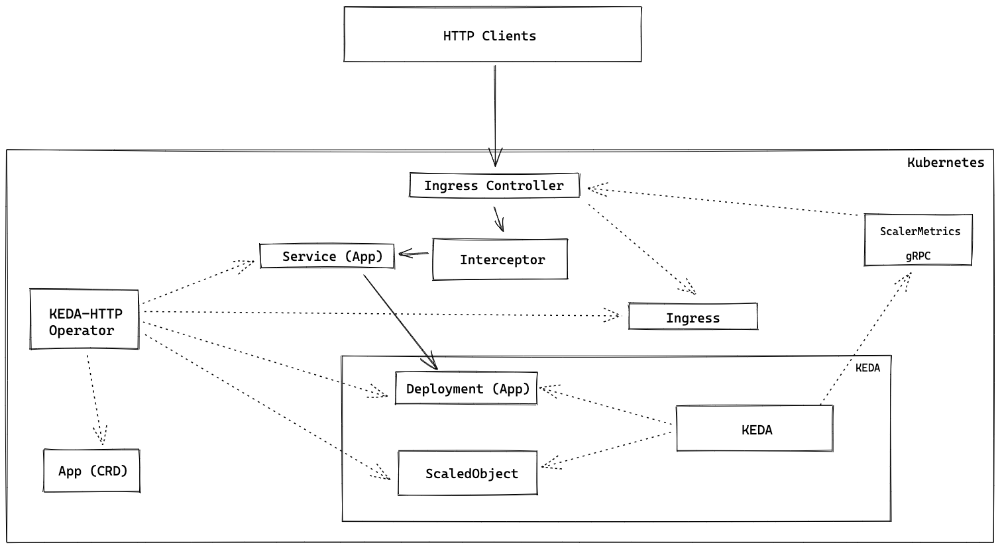

# The Design of HTTP Add-on

This project is primarily a composition of mostly independent components. We've chosen this design so that you can swap out components as you want/need to while still achieving (roughly) the same functionality.

## High Level Components

There are three major components in this system. You can find more detail and discussion about each in sections below this one.

- [Operator](../operator) - This component listens for events related to `HTTPScaledObject`s and creates, updates or removes internal machinery as appropriate.
- [Interceptor](../interceptor) - This component accepts and routes external HTTP traffic to the appropriate internal application, as appropriate.
- [Scaler](../scaler) - This component tracks the size of the pending HTTP request queue for a given app and reports it to KEDA. It acts as an [external scaler](https://keda.sh/docs/latest/scalers/external-push/).
- [KEDA](https://keda.sh) - KEDA acts as the scaler for the user's HTTP application.

## Functionality Areas

We've split this project into a few different major areas of functionality, which inform the architecture. I'll describe both concurrently below and provide a complete architecture diagram.

### Fast Deployment of HTTP Apps

We've introduced a new [Custom Resource (CRD)](https://kubernetes.io/docs/concepts/extend-kubernetes/api-extension/custom-resources/) called `HTTPScaledObject.http.keda.sh` - `HTTPScaledObject` for short. Fundamentally, this resource allows an application developer to submit their HTTP-based application name and container image to the system, and have the system deploy all the necessary internal machinery required to deploy their HTTP application and expose it to the public internet.

The [operator](../operator) runs inside the Kubernetes namespace to which they're deploying their application and watches for these `HTTPScaledObject` resources. When one is created, it does the following:

- Update an internal routing table that maps incoming HTTP hostnames to internal applications.
- Furnish this routing table information to interceptors so that they can properly route requests.
- Create a [`ScaledObject`](https://keda.sh/docs/latest/concepts/scaling-deployments/#scaledobject-spec) for the `Deployment` specified in the `HTTPScaledObject` resource.

When the `HTTPScaledObject` is deleted, the operator reverses all of the aforementioned actions.

### Autoscaling for HTTP Apps

After an `HTTPScaledObject` is created and the operator creates the appropriate resources, you must send HTTP requests through the interceptor so that the application is scaled. A Kubernetes `Service` called `keda-add-ons-http-interceptor-proxy` was created when you `helm install`ed the add-on. Send requests to that service.

The interceptor keeps track of the number of pending HTTP requests - HTTP requests that it has forwarded but the app hasn't returned. The scaler periodically makes HTTP requests to the interceptor via an internal RPC endpoint - on a separate port from the public server - to get the size of the pending queue. Based on this queue size, it reports scaling metrics as appropriate to KEDA. As the queue size increases, the scaler instructs KEDA to scale up as appropriate. Similarly, as the queue size decreases, the scaler instructs KEDA to scale down.

#### The Horizontal Pod Autoscaler

The HTTP Add-on works with the Kubernetes [Horizontal Pod Autoscaler](https://kubernetes.io/docs/tasks/run-application/horizontal-pod-autoscale/#algorithm-details) (HPA) -- via KEDA itself -- to execute scale-up and scale-down operations (except for scaling between zero and non-zero replicas). You configure the scaling target in the [HTTPScaledObject](./ref/vX.X.X/http_scaled_object.md) via `spec.scalingMetric`, using either `requestRate` (target value, granularity, and time window) or `concurrency` (target value). The add-on furnishes KEDA with the current metric and the desired value from that config. KEDA then sends these to the HPA, which uses them as `currentMetricValue` and `desiredMetricValue` in the [HPA Algorithm](https://kubernetes.io/docs/tasks/run-application/horizontal-pod-autoscale/#algorithm-details).

The net effect is that the add-on scales up when the metric (e.g. request rate over the window or concurrent requests) exceeds the `targetValue` in `spec.scalingMetric`, and scales down when it is below that value.

>The aforementioned HPA algorithm is pasted here for convenience: `desiredReplicas = ceil[currentReplicas * ( currentMetricValue / desiredMetricValue )]`. The `targetValue` from your `scalingMetric` (e.g. `requestRate.targetValue` or `concurrency.targetValue`) is used as `desiredMetricValue`; the current metric reported by the scaler is used as `currentMetricValue`.

## Architecture Overview

Although the HTTP Add-on is very configurable and supports multiple different deployments, the below diagram is the most common architecture that is shipped by default.

[Go back to landing page](./)
