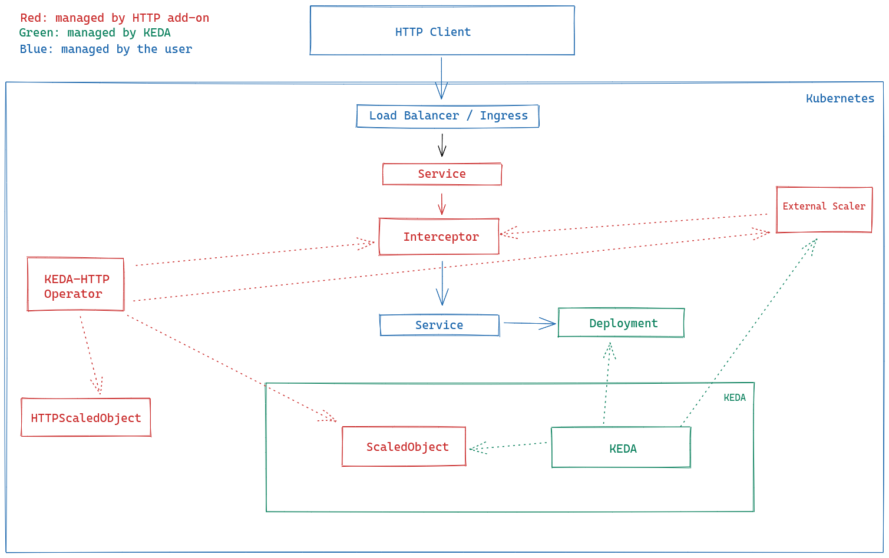

# The Design of HTTP-Add-On

This project is primarily a composition of mostly independent components. We've chosen this design so that you can swap out components as you want/need to while still achieving (roughly) the same functionality.

## High Level Components

There are three major components in this system. You can find more detail and discussion about each in sections below this one.

- [Operator](../operator) - This component listens for events related to `HTTPScaledObject`s and creates, updates or removes internal machinery as appropriate.
- [Interceptor](../interceptor) - This component accepts and routes external HTTP traffic to the appropriate internal application, as appropriate.
- [Scaler](../scaler) - This component tracks the size of the pending HTTP request queue for a given app and reports it to KEDA. It acts as an [external scaler](https://keda.sh/docs/2.1/scalers/external-push/).
- [KEDA](https://keda.sh) - KEDA acts as the scaler for the user's HTTP application.

## Functionality Areas

We've split this project into a few different major areas of functionality, which inform the architecture. I'll describe both concurrently below and provide a complete architecture diagram.

### Fast Deployment of HTTP Apps

We've introduced a new [Custom Resource (CRD)](https://kubernetes.io/docs/concepts/extend-kubernetes/api-extension/custom-resources/) called `HTTPScaledObject.http.keda.sh` - `HTTPScaledObject` for short. Fundamentally, this resource allows an application developer to submit their HTTP-based application name and container image to the system, and have the system deploy all the necessary internal machinery required to deploy their HTTP application and expose it to the public internet.

The [operator](../operator) runs inside the Kubernetes namespace to which they're deploying their application and watches for these `HTTPScaledObject` resources. When one is created, it will create a `Deployment` and `Service` for the app, interceptor, and scaler, and a [`ScaledObject`](https://keda.sh/docs/2.1/concepts/scaling-deployments/) which KEDA then uses to scale the application.

When the `HTTPScaledObject` is deleted, the operator then removes all of the aforementioned resources.

### Autoscaling for HTTP Apps

After an `HTTPScaledObject` is created and the operator creates the appropriate resources, there is a public IP address (and DNS entry, if configured) and the interceptor takes over. When HTTP traffic enters the system from the public internet, the interceptor accepts it and forwards it to the app's `Service` IP (it is most commonly configured as a `ClusterIP` service).

At the same time, the interceptor keeps track of the size of the pending HTTP requests - HTTP requests that it has forwarded but the app hasn't returned. The scaler periodically makes HTTP requests to the interceptor via an internal HTTP endpoint - on a separate port from the public server - to get the size of the pending queue. Based on this queue size, it reports scaling metrics as appropriate to KEDA. As the queue size increases, the scaler instructs KEDA to scale up as appropriate. Similarly, as the queue size decreases, the scaler instructs KEDA to scale down.

## Architecture Overview

Although the HTTP add on is very configurable and supports multiple different deployments, the below diagram is the most common architecture that is shipped by default.

